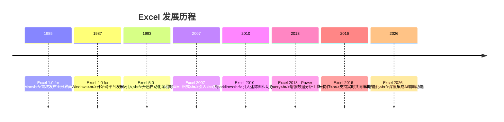
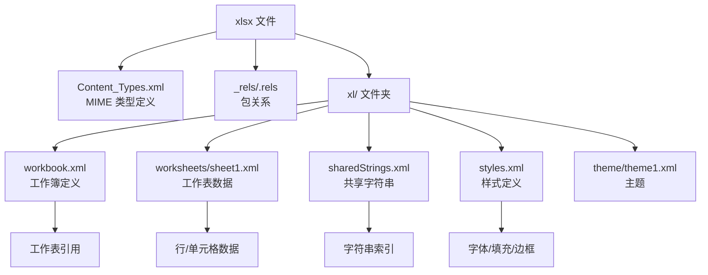
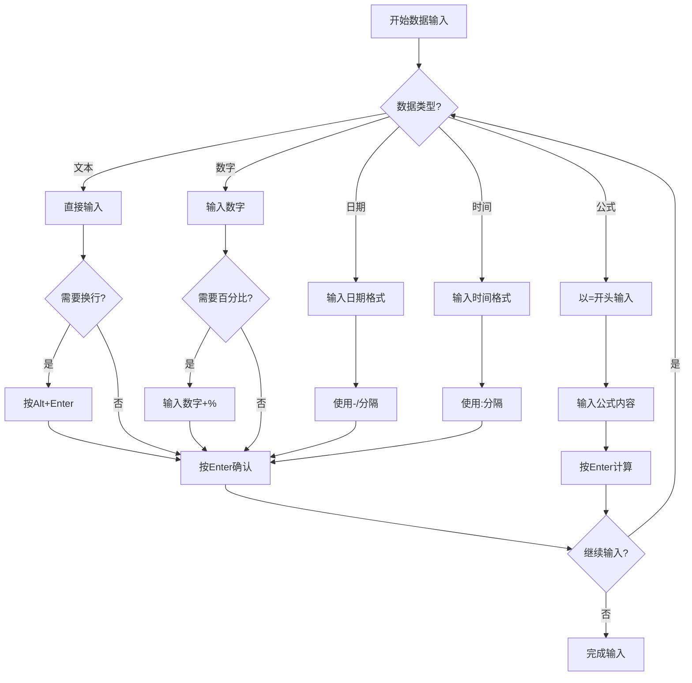
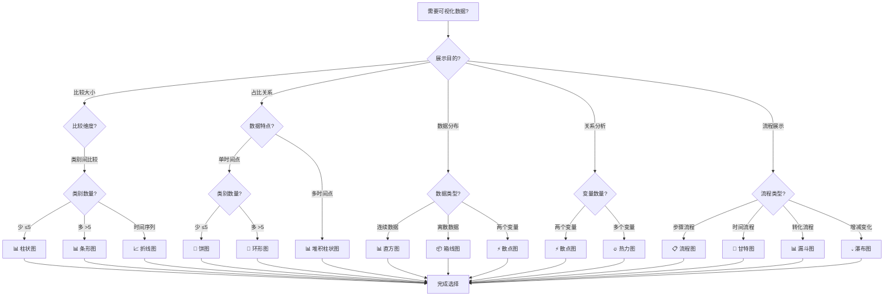
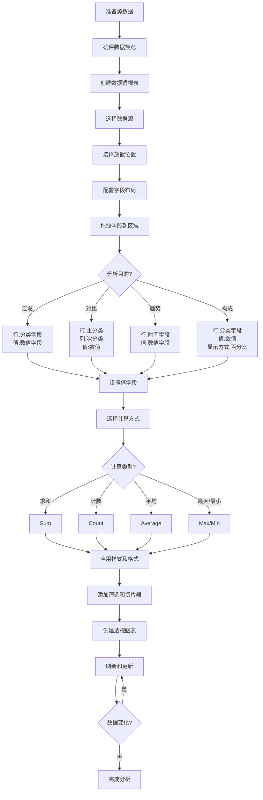
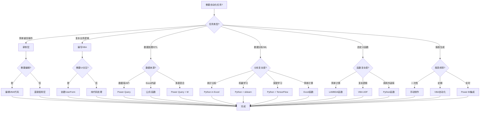
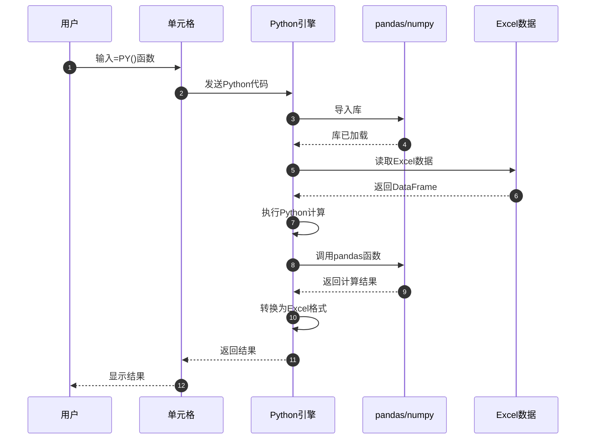
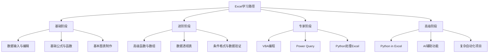

# Excel 全方位学习指南：从基础操作到编程自动化

> 作为一款拥有40年历史的电子表格软件,Excel已成为全球数据处理的核心工具。本文将带你全面了解Excel的知识体系,从基础操作到高级编程,让你真正掌握Excel的强大功能。

## 一、Excel的发展历程与重要性

Excel自1985年首次发布以来,已经发展成为世界上最强大的电子表格软件。让我们回顾一下Excel的重要发展节点:



Excel的重要性不言而喻:
- **数据处理核心**: 企业和个人数据处理的首选工具
- **分析能力强大**: 支持复杂的公式、函数和数据分析
- **可视化出色**: 丰富的图表和可视化功能
- **自动化能力**: 通过VBA、Python等实现自动化处理
- **生态完善**: 与Office套件深度集成

## 二、xlsx文件格式深度解析

理解xlsx文件格式对于高级Excel用户和开发者至关重要。xlsx文件本质上是一个ZIP压缩包,包含多个XML文件。

### 2.1 xlsx文件核心结构



### 2.2 核心文件说明

**[Content_Types].xml**
定义包中所有部件的MIME类型,这是xlsx文件的"目录"。

**xl/workbook.xml**
工作簿定义文件,包含工作表列表、命名范围等信息。

**xl/worksheets/sheet1.xml**
工作表的实际数据,使用稀疏矩阵存储,只包含有数据的单元格。

**xl/sharedStrings.xml**
共享字符串表,存储所有文本内容,优化存储空间。

**xl/styles.xml**
样式定义文件,包含字体、填充、边框等样式信息。

### 2.3 编程读取xlsx文件

开发者可以直接操作xlsx文件的XML结构,也可以使用成熟的库:

**Python方案**
```python
import openpyxl
import pandas as pd

# 使用openpyxl读取
wb = openpyxl.load_workbook('data.xlsx')
ws = wb.active

# 使用pandas读取(推荐)
df = pd.read_excel('data.xlsx', sheet_name='Sheet1')
```

**Go方案**
```go
import "github.com/xuri/excelize/v2"

f, _ := excelize.OpenFile("data.xlsx")
rows, _ := f.GetRows("Sheet1")
```

## 三、Excel基础操作详解

### 3.1 数据输入技巧

Excel提供了多种便捷的数据输入方式:

**基本输入方法**
- 直接输入: 点击单元格后直接输入
- 快捷键: Enter确认、Tab右移、Esc取消
- 填充柄: 拖动右下角小方块快速填充

**特殊数据输入**
```
日期: 2026-1-15 或 2026/1/15
时间: 14:30 或 2:30 PM
分数: 0 1/2 (避免被识别为日期)
当前日期: Ctrl + ;
当前时间: Ctrl + Shift + ;
```

**数据输入流程**


### 3.2 单元格选择技巧

快速选择单元格能大大提高工作效率:

**选择方式**
- 单个单元格: 直接点击
- 连续区域: 拖动或Shift+点击
- 不连续区域: Ctrl+点击多个单元格
- 整行/整列: 点击行号/列标

**快捷键选择**
```
Ctrl + A: 选择当前数据区域
Ctrl + Shift + End: 选择到数据区域末尾
Ctrl + Space: 选择整列
Shift + Space: 选择整行
Ctrl + Shift + ↓: 选择到列末
Ctrl + Shift + →: 选择到行末
```

### 3.3 数据编辑与格式化

**清除单元格**
- 清除全部: 删除内容、格式和批注
- 清除格式: 只删除格式设置
- 清除内容: 只删除单元格内容
- 清除批注: 只删除批注

**数字格式快捷键**
```
Ctrl+Shift+~: 常规格式
Ctrl+Shift+!: 千分位分隔符
Ctrl+Shift+$: 货币格式
Ctrl+Shift+%: 百分比格式
Ctrl+Shift+^: 科学计数法
Ctrl+Shift+#: 日期格式
Ctrl+Shift+@: 时间格式
```

## 四、公式与函数完全指南

### 4.1 公式基础

Excel公式总是以等号(=)开头,包含运算符、单元格引用、数值、函数和常量。

**运算符优先级**
1. 括号(())
2. 引用运算符(: , 空格)
3. 负数(-)
4. 百分比(%)
5. 乘方(^)
6. 乘除(* /)
7. 加减(+ -)
8. 连接(&)
9. 比较(= < > <= >= <>)

### 4.2 单元格引用类型

```mermaid
flowchart TD
    A[需要引用单元格?] --> B{复制公式时<br/>引用如何变化?}
    
    B -->|行列都变化| C[相对引用<br/>A1]
    B -->|行列都不变| D[绝对引用<br/>$A$1]
    B -->|只固定列| E[混合引用<br/>$A1]
    B -->|只固定行| F[混合引用<br/>A$1]
    
    C --> G{使用场景?}
    G -->|批量计算| H[✓ 适合]
    G -->|固定参数| I[✗ 不适合]
    
    D --> J{使用场景?}
    J -->|固定参数| K[✓ 适合]
    J -->|批量计算| L[✗ 不适合]
    
    E --> M{使用场景?}
    M -->|乘法表| N[✓ 适合]
    M -->|矩阵计算| O[✓ 适合]
    
    F --> P{使用场景?}
    P -->|跨列比较| Q[✓ 适合]
    P -->|横向填充| R[✓ 适合]
    
    B -->|引用表格列| S[结构化引用<br/>Table1[Column1]]
    S --> T{使用场景?}
    T -->|表格数据| U[✓ 推荐]
    T -->|动态范围| V[✓ 推荐]
    
    H --> W[完成选择]
    I --> W
    K --> W
    L --> W
    N --> W
    O --> W
    Q --> W
    R --> W
    U --> W
    V --> W
```

**引用快捷键**
- 选中引用后按F4键,可以在不同引用类型间切换
- 切换顺序: A1 → $A$1 → A$1 → $A1 → A1

### 4.3 常用函数大全

**数学函数**
```excel
SUM(range): 求和
AVERAGE(range): 平均值
MAX(range): 最大值
MIN(range): 最小值
ROUND(n, d): 四舍五入
MOD(n, d): 求余数
```

**文本函数**
```excel
LEFT(text, n): 从左提取
RIGHT(text, n): 从右提取
MID(text, s, n): 从中间提取
LEN(text): 文本长度
TEXTJOIN(d, i, r): 连接文本
```

**日期函数**
```excel
TODAY(): 当前日期
NOW(): 当前日期时间
DATE(y, m, d): 创建日期
DATEDIF(s, e, u): 日期差
WORKDAY(s, d): 工作日
```

**查找函数**
```excel
XLOOKUP(...): 增强查找
FILTER(a, i): 筛选数据
INDEX(a, r, c): 返回指定值
MATCH(v, a, t): 查找位置
```

**逻辑函数**
```excel
IF(c, t, f): 条件判断
IFS(...): 多条件判断
AND(...): 与逻辑
OR(...): 或逻辑
SWITCH(...): 多值匹配
```

**统计函数**
```excel
COUNTIF(r, c): 条件计数
COUNTIFS(...): 多条件计数
SUMIF(r, c, s): 条件求和
SUMIFS(...): 多条件求和
```

### 4.4 动态数组函数(Excel 2019+)

动态数组函数是Excel的重大革新,让数组操作变得简单:

**常用动态数组函数**
```excel
UNIQUE(a): 返回唯一值列表
FILTER(a, i): 根据条件筛选数据
SORT(a, i, o): 对数据进行排序
SEQUENCE(...): 生成数字序列
SORTBY(...): 多列排序
```

**实际应用示例**
```excel
=UNIQUE(A1:A10)
' 返回A1到A10中的唯一值列表

=FILTER(A1:B10, B1:B10>60)
' 返回B列大于60的所有行

=SORT(A1:B10, 2, -1)
' 按第2列降序排序

=SEQUENCE(5, 3, 1, 1)
' 生成5行3列的序列,从1开始,步长为1
```

### 4.5 LAMBDA函数(Excel 2021+)

LAMBDA函数让你可以创建自定义函数,无需VBA:

```excel
=LAMBDA(x, x^2)
' 定义平方函数

=LAMBDA(x, y, SQRT(x^2 + y^2))
' 定义勾股定理函数
```

### 4.6 错误处理

**常见错误类型**
- #VALUE!: 参数类型错误
- #DIV/0!: 除以零
- #REF!: 引用无效
- #NAME?: 名称未定义
- #N/A: 值不可用
- #NUM!: 数值错误

**错误处理函数**
```excel
IFERROR(value, error_value): 处理所有错误
IFNA(value, na_value): 只处理#N/A错误
ERROR.TYPE(error_val): 返回错误类型编号
ISERROR(value): 检查是否为错误
ISNA(value): 检查是否为#N/A
```

### 4.7 AI辅助公式(Excel 2026新特性)

Excel 2026引入AI辅助功能,让公式编写更加智能:

**自然语言公式生成**
- 用自然语言描述想要的计算
- Excel自动生成公式
- 示例:"计算A列的平均值" → =AVERAGE(A:A)

**智能公式建议**
- 根据上下文推荐合适的函数
- 分析数据结构,提供最优方案
- 识别常见计算模式

## 五、图表制作与数据可视化

### 5.1 图表类型选择指南



### 5.2 图表创建流程


### 5.3 常用图表类型

**柱状图**
- 适用场景: 比较不同类别的数值大小
- 变体: 簇状柱形图、堆积柱形图、百分比堆积柱形图

**折线图**
- 适用场景: 显示数据随时间变化的趋势
- 特点: 能清晰显示趋势和变化

**饼图**
- 适用场景: 显示各部分占总体的比例
- 注意: 不宜显示过多类别(建议不超过5-7个)

**散点图**
- 适用场景: 显示两个变量之间的关系
- 优势: 能发现数据中的模式和相关性

**直方图**
- 适用场景: 显示数据的分布情况
- 用途: 频率分布分析、数据集中趋势

**瀑布图**
- 适用场景: 显示初始值如何受正负值影响
- 应用: 财务分析、利润构成分析

### 5.4 图表美化原则

**配色方案**
- 使用协调的颜色方案
- 避免使用过多颜色(建议不超过5-6种)
- 使用对比色突出重要数据

**字体选择**
- 使用清晰易读的字体
- 标题字体略大于标签字体
- 保持字体风格一致

**布局设计**
- 保持图表简洁,避免过度装饰
- 合理留白,避免拥挤
- 删除不必要的网格线和图例

**图表元素**
- 坐标轴标题: 说明坐标轴含义
- 图表标题: 简洁明了,概括图表内容
- 数据标签: 数据点少时添加
- 图例: 多数据系列时必需

## 六、数据透视表:Excel最强大的分析工具

### 6.1 数据透视表工作流程



### 6.2 数据透视表基础

**数据透视表的优势**
- 无需编写复杂的公式
- 实时响应用户操作
- 支持海量数据处理
- 可以与图表联动
- 易于分享和更新

**四个关键区域**
- 筛选(Filters): 放置筛选字段,影响整个报表
- 列(Columns): 放置要作为列标题的字段
- 行(Rows): 放置要作为行标题的字段
- 值(Values): 放置要汇总计算的字段

### 6.3 值字段设置

**汇总方式**
- 求和(Sum): 计算数值总和
- 计数(Count): 计算非空单元格数
- 平均值(Average): 计算算术平均值
- 最大值(Max): 返回最大值
- 最小值(Min): 返回最小值
- 乘积(Product): 计算乘积

**值显示方式**
- 总计的百分比: 显示占总体的比例
- 列汇总的百分比: 显示占列总计的比例
- 行汇总的百分比: 显示占行总计的比例
- 差异: 显示与指定项的差值
- 差异百分比: 显示与指定项的百分比差异
- 累计: 显示累计值
- 累计百分比: 显示累计百分比
- 排名: 显示排名

### 6.4 分组功能

**日期分组**
- 右键点击日期字段,选择"分组"
- 可按年、季度、月、日分组
- 支持自定义起始和结束日期

**数值分组**
- 将数值字段分组为区间
- 设置起始值和结束值
- 设置步长(区间大小)

### 6.5 筛选和切片器

**报表筛选**
- 将字段放入"筛选"区域
- 在报表顶部创建筛选器

**切片器**(推荐)
- 可视化的筛选工具
- 支持多选(Ctrl+点击)
- 可以连接多个透视表

**时间线**
- 专门用于日期字段的筛选工具
- 拖动滑块选择时间范围
- 可按年、季度、月、日筛选

### 6.6 数据透视图表

**创建透视图表**
- 选中数据透视表
- 点击"分析"选项卡 > "数据透视图"
- 选择图表类型

**透视图表特点**
- 与数据透视表联动
- 共享筛选器和切片器
- 动态更新数据
- 支持钻取和展开

## 七、编程处理Excel:从VBA到Python

### 7.1 Excel自动化方案选择



### 7.2 VBA宏基础

VBA(Visual Basic for Applications)是Excel传统的自动化方案:

**VBA的优势**
- 与Excel深度集成
- 功能强大,可完成复杂任务
- 可创建自定义UI
- 跨Office应用交互

**VBA示例**
```vba
Sub SummarizeSales()
    Dim ws As Worksheet
    Dim lastRow As Long
    Dim i As Long
    Dim total As Double
    
    Set ws = ThisWorkbook.Sheets("Sales")
    lastRow = ws.Cells(ws.Rows.Count, "A").End(xlUp).Row
    
    total = 0
    For i = 2 To lastRow
        total = total + ws.Cells(i, "C").Value
    Next i
    
    ws.Range("C" & lastRow + 1).Value = total
    ws.Range("C" & lastRow + 1).Font.Bold = True
End Sub
```

### 7.3 Power Query入门

Power Query是Excel内置的强大数据连接和转换工具:

**Power Query特点**
- 可视化操作,无需编程
- 支持多种数据源
- 可重复使用的查询
- 自动刷新数据

**常见转换操作**
- 删除/重命名/移动列
- 筛选和排序
- 拆分和合并列
- 更改数据类型
- 透视和逆透视
- 合并和追加查询

### 7.4 Python处理Excel

Python拥有丰富的Excel处理库,是数据分析的首选:

**常用库对比**
- openpyxl: 支持xlsx格式,功能全面
- pandas: 数据分析强大,简洁易用
- xlsxwriter: 只写,支持图表和格式
- xlrd: 支持.xls旧格式

**Python示例**
```python
import pandas as pd

# 读取Excel数据
df = pd.read_excel('sales_data.xlsx')

# 数据筛选
high_sales = df[df["销售额"] > 10000]

# 分组聚合
region_summary = df.groupby("地区").agg({
    "销售额": "sum",
    "数量": "mean"
}).reset_index()

# 数据透视表
pivot = pd.pivot_table(
    df,
    values="销售额",
    index="产品",
    columns="地区",
    aggfunc="sum",
    fill_value=0
)

# 保存结果
with pd.ExcelWriter('analysis_result.xlsx') as writer:
    high_sales.to_excel(writer, sheet_name="高销售额", index=False)
    region_summary.to_excel(writer, sheet_name="地区汇总", index=False)
    pivot.to_excel(writer, sheet_name="产品透视")
```

### 7.5 Go处理Excel

Go语言以高性能和并发著称,适合大规模Excel处理场景:

**常用库**
- excelize: 纯Go实现,性能好
- unioffice: 功能全面,支持Office所有格式
- xlsx: 轻量级,只读

**Go示例**
```go
package main

import (
    "fmt"
    "github.com/xuri/excelize/v2"
)

func main() {
    // 创建新工作簿
    f := excelize.NewFile()
    defer f.Close()

    // 设置单元格值
    f.SetCellValue("Sheet1", "A1", "姓名")
    f.SetCellValue("Sheet1", "B1", "销售额")

    // 写入数据
    data := [][]interface{}{
        {"张三", 150000},
        {"李四", 120000},
    }

    for i, row := range data {
        for j, value := range row {
            cell, _ := excelize.CoordinatesToCellName(j+1, i+2)
            f.SetCellValue("Sheet1", cell, value)
        }
    }

    // 保存文件
    if err := f.SaveAs("output.xlsx"); err != nil {
        fmt.Println(err)
    }
}
```

### 7.6 Python in Excel(Excel 2026新特性)

Excel 2026引入Python in Excel功能,让Python可以直接在Excel中运行:

**执行流程**


**使用示例**
```excel
=PY(pd.DataFrame({
    "姓名": ["张三", "李四", "王五"],
    "年龄": [28, 32, 25],
    "城市": ["北京", "上海", "广州"]
}))
```

### 7.7 LAMBDA函数

LAMBDA函数让你可以创建自定义函数,无需VBA:

```excel
=LAMBDA(x, x^2)
' 定义平方函数

=LAMBDA(x, y, SQRT(x^2 + y^2))
' 定义勾股定理函数

=LAMBDA(data, LET(
    avg, AVERAGE(data),
    std, STDEV(data),
    (data - avg) / std
))
' 定义标准化函数
```

## 八、Excel 2026新特性

### 8.1 AI辅助功能

Excel 2026深度集成AI辅助功能:

**自然语言公式**
- 用自然语言描述计算
- AI自动生成公式
- 示例:"计算销售额的平均值" → =AVERAGE(销售额)

**智能图表推荐**
- AI分析数据类型和结构
- 自动推荐最适合的图表类型
- 提供多种图表方案

**数据透视表智能建议**
- AI分析数据特征
- 自动推荐最佳字段布局
- 提供多种分析视角

### 8.2 Python in Excel

Python in Excel是Excel 2026的重大更新:

**特点**
- Python直接在Excel中运行
- 支持pandas、numpy等库
- 结果自动显示在单元格中
- 安全的云端沙箱环境

**应用场景**
- 数据分析
- 机器学习
- 数据可视化
- 高级统计

### 8.3 其他新特性

**增强的数据分析**
- 更强大的动态数组函数
- 改进的数据透视表
- 增强的Power Query功能

**协作功能**
- 实时共同编辑
- 改进的版本历史
- 更好的云集成

**性能提升**
- 更快的计算引擎
- 优化的内存使用
- 改进的大数据处理

## 九、Excel最佳实践

### 9.1 数据管理最佳实践

**数据规范**
- 每列有明确的标题
- 无空行和空列
- 数据格式一致
- 无合并单元格

**数据组织**
- 使用表格(Ctrl+T)管理数据
- 合理使用命名范围
- 保持数据结构清晰

### 9.2 公式编写最佳实践

**公式设计**
- 使用有意义的命名范围
- 避免过长的公式
- 适当使用注释
- 考虑使用LAMBDA函数

**性能优化**
- 避免使用易失性函数
- 减少数组公式使用
- 优化引用范围
- 使用表格引用

### 9.3 图表设计最佳实践

**设计原则**
- 简洁明了
- 突出重点
- 保持一致
- 易于理解

**配色方案**
- 使用协调的颜色
- 避免过多颜色
- 考虑色盲友好
- 与品牌一致

### 9.4 自动化最佳实践

**方案选择**
- 简单任务用录制宏
- 复杂逻辑用VBA
- 数据转换用Power Query
- 数据分析用Python

**代码规范**
- 添加注释
- 使用有意义的变量名
- 错误处理
- 文档记录

## 十、学习路径与资源

### 10.1 学习路径



### 10.2 推荐学习资源

**官方资源**
- Microsoft Excel官方文档
- Excel官方博客
- Office Dev Center

**在线课程**
- 微软虚拟学院
- Coursera Excel课程
- Udemy Excel教程

**社区资源**
- Excel论坛
- Stack Overflow
- GitHub Excel项目

**书籍推荐**
- 《Excel 2026宝典》
- 《Excel公式与函数大全》
- 《Excel VBA编程从入门到精通》

## 结语

Excel是一款功能强大、应用广泛的电子表格软件。从基础的数据输入到高级的编程自动化,Excel为我们提供了完整的解决方案。

随着AI技术的发展,Excel正在变得更加智能化。Python in Excel、AI辅助公式、智能图表推荐等新功能,让Excel的使用变得更加简单和高效。

无论你是Excel新手还是资深用户,都可以通过本文的内容,系统地学习和掌握Excel的各种功能。记住,实践是最好的学习方式,多动手操作,多解决实际问题,才能真正掌握Excel的精髓。

让我们一起在Excel的世界中探索更多可能性,让数据为我们创造更大的价值!

---

**关于作者**
本文基于Excel 2026版本编写,涵盖了Excel的完整知识体系。如果你有任何问题或建议,欢迎与我们交流。

**版权声明**
本文内容仅供学习和参考,如需转载请注明出处。